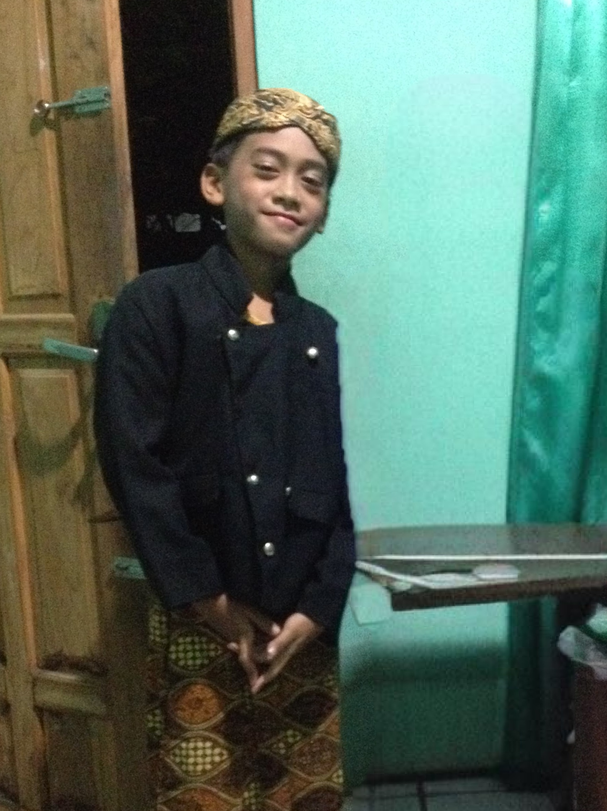

# 🌹 Website Ulang Tahun Raihan — Panduan Ana

## 📁 Struktur Folder

```
birthday-raihan/
│
├── index.html          ← File utama website
├── CARA-PAKAI.md       ← Panduan ini
│
├── music/
│   └── a-thousand-years.mp3   ← Taruh file musik di sini
│
├── photos/
│   ├── masakecil-1.jpg        ← Foto masa kecil Raihan #1
│   ├── masakecil-2.jpg        ← Foto masa kecil Raihan #2
│   ├── masakecil-3.jpg        ← Foto masa kecil Raihan #3
│   ├── firstdate.jpg          ← Foto first date kalian
│   ├── kenangan-1.jpg         ← Foto kenangan #1
│   ├── kenangan-2.jpg         ← Foto kenangan #2
│   ├── kenangan-3.jpg         ← Foto kenangan #3
│   ├── kenangan-4.jpg         ← Foto kenangan #4
│   ├── kenangan-5.jpg         ← Foto kenangan #5
│   └── kita-berdua.jpg        ← Foto kalian berdua (scene ending)
│
└── videos/
    ├── ucapan.mp4             ← Video ucapan dari Ana ke Raihan
    └── bts.mp4                ← Video BTS pembuatan website
```

---

## ✏️ Yang Perlu Diedit di index.html

Buka `index.html` dengan text editor (Notepad++ / VS Code).
Cari komentar `<!-- GANTI INI -->` atau `<!-- ============ -->` untuk menemukan bagian yang perlu diubah.

### 1. 🎵 Musik
Cari: `<source src="music/a-thousand-years.mp3"`  
→ Pastikan file musiknya sudah ada di folder `music/`

### 2. 📖 Cerita Awal Kenal (Scene 3)
Cari bagian `typewriterLines` di JavaScript, lalu edit baris:
```js
{ text: "[Tulis cerita singkat awal kenal kalian di sini…]", cls: "tw-line" },
```
Ganti dengan cerita kalian, bisa beberapa baris, contoh:
```js
{ text: "Aku ga nyangka satu notif bisa sejauh ini…", cls: "tw-line" },
{ text: "Tapi ternyata itu awal dari segalanya.", cls: "tw-line highlight" },
```

### 3. 🌊 Cerita First Date (Scene 4)
Cari: `5 September 2025 — pantai, mainan air…`  
→ Edit paragraf ceritanya sesuka kamu.

### 4. 😂 Inside Jokes (Scene 6)
Cari `[Tulis inside joke / momen lucu #1 di sini]`  
→ Ganti isi teks di dalam `.text` untuk tiap kartu jokes.  
→ Boleh tambah/kurangi kartu (copy-paste `<div class="joke-card">` baru).

### 5. 🖼️ Foto
Untuk setiap foto, cari baris yang dikomentari seperti:
```html
<!--  -->
```
Hapus `<!--` dan `-->` untuk mengaktifkan, lalu pastikan file foto sudah ada.

### 6. 🎥 Video Ucapan (Scene 7)
Cari:
```html
<!-- <video id="main-video" controls playsinline> -->
```
Hapus komentarnya untuk mengaktifkan video.

### 7. 🎬 Video BTS (Scene 9)
Sama seperti video ucapan, cari komentar di Scene 9 dan aktifkan.

---

## 🚀 Cara Share ke Raihan

**Opsi termudah (gratis):**
1. Buat akun di [netlify.com](https://netlify.com)
2. Drag & drop seluruh folder `birthday-raihan/` ke Netlify
3. Kamu dapat link seperti: `https://namawebsite.netlify.app`
4. Kirim linknya ke Raihan pas tepat jam 00.00 tanggal 15 Maret! 🎂

**Opsi lain:**
- GitHub Pages (gratis)
- Vercel (gratis)

---

## ⚠️ Tips Penting

- Ukuran video sebaiknya di bawah **50MB** biar loading cepat di HP
- Foto sebaiknya di bawah **1MB** per foto (resize dulu di [squoosh.app](https://squoosh.app))
- Test di HP dulu sebelum kirim ke Raihan!
- Pastikan nama file **sama persis** (huruf kecil semua)

---

*Made with 💕 — Semoga Raihan nangis terharu ya, Ana!*